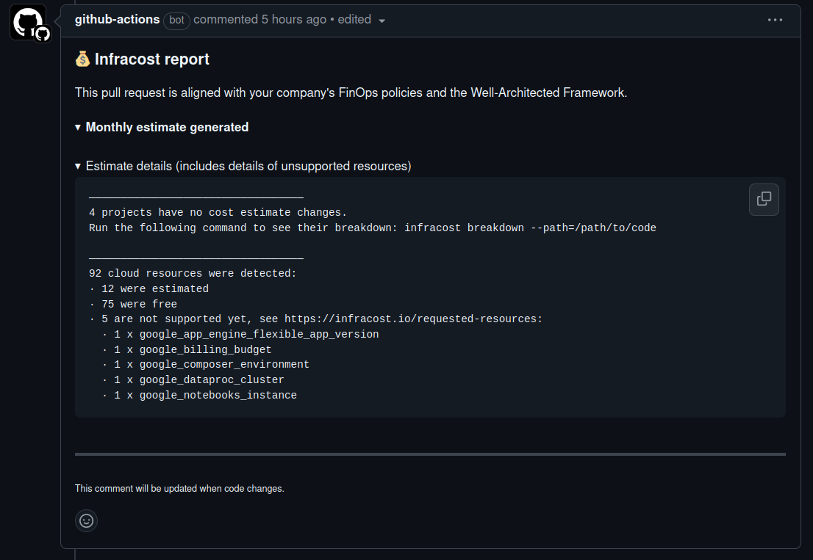

IMPORTANT ❗ ❗ ❗ Please remember to destroy all the resources after each work session. You can recreate infrastructure by creating new PR and merging it to master.
  


1. Authors:

   groupr nr: **z4**

   repo: [MikolajSzawerda/tbd-workshop-1](https://github.com/MikolajSzawerda/tbd-workshop-1)

   - Mikołaj Szawerda (318731)
   - Anna Schafer
   - Patryk Filip Gryz

2. Follow all steps in README.md.

3. In boostrap/variables.tf add your emails to variable "budget_channels".

4. From avaialble Github Actions select and run destroy on main branch.
   
5. Create new git branch and:
    1. Modify tasks-phase1.md file.
    
    2. Create PR from this branch to **YOUR** master and merge it to make new release. 
    
    


6. Analyze terraform code. Play with terraform plan, terraform graph to investigate different modules.

    **Cluster structure**

    

    **Vertex AI module structure**

    

    This module defines all necessary resources to deploy Vertex AI Notebooks:

    - Creates a storage bucket for notebook configurations, environment data, and includes a script for uploading them

    - Provides bindings to a GCP project, with the ability to generate access tokens and connect to other GCP services (such as BigQuery)

    The module is part of a larger Vertex AI GCP solution designed to streamline Big Data and AI tasks. It enables the creation of Jupyter-like environments that can integrate with services like BigQuery, Dataproc, and other GCP tools. Additionally, it supports machine learning model training and inference, offering advanced features such as distributed training, hyperparameter tuning, continuous training pipelines, and large-scale data analysis.
   
7. Reach YARN UI
   ```shell
   gcloud compute ssh tbd-cluster-m --project=tbd-2025l-318731 --zone=europe-west1-d -- -L 8088:localhost:8088
   ```
   
   

8. Draw an architecture diagram (e.g. in draw.io) that includes:
    1. VPC topology with service assignment to subnets
    2. Description of the components of service accounts
        - tbd-2025l-318731-lab@tbd-2025l-318731.iam.gserviceaccount.com (tbd-terraform) - wykorzystywane do kominikacji oraz zarządzania infrastrukturą projektu w Google Cloud za pomocą Terraform, umożliwiając kontrolowanie zasobów i płynną integrację.
        - 152206387777-compute@developer.gserviceaccount.com (iac) - zarządza tokenami dostępu oraz zapewnia płynną komunikację pomiędzy Githubem a Google Cloudem.
        - tbd-2025l-318731-data@tbd-2025l-318731.iam.gserviceaccount.com (tbd-composer-sa) - koordynuje i zarzadza operacjami związanymi z danymi w obrębie środowisk Cloud Composer, klastrów Dataproc i innych powiązanych zadań.
    3. List of buckets for disposal
    4. Description of network communication (ports, why it is necessary to specify the host for the driver) of Apache Spark running from Vertex AI Workbech
        - Określenie hosta dla sterownika (driver) jest ważne, poniważ jest on potrzebny do koordynowania zadań, a węzły robocze (workers) muszą komunikować się z węzłem sterownika, który zwraca wynik.
  
    

9. Create a new PR and add costs by entering the expected consumption into Infracost
For all the resources of type: `google_artifact_registry`, `google_storage_bucket`, `google_service_networking_connection`
create a sample usage profiles and add it to the Infracost task in CI/CD pipeline. Usage file [example](https://github.com/infracost/infracost/blob/master/infracost-usage-example.yml) 
   ```yaml
   version: 0.1
    usage:
      google_artifact_registry.registry:
        storage_gb: 60

      google_storage_bucket.tbd_code_bucket:
        storage_gb: 200
        monthly_class_a_operations: 100
        monthly_class_b_operations: 300
        monthly_egress_data_gb: 70

      google_storage_bucket.tbd_data_bucket:
        storage_gb: 400
        monthly_class_a_operations: 100
        monthly_class_b_operations: 300
        monthly_egress_data_transfer_gb:
          same_continent: 90
          worldwide: 40
          asia: 20
          china: 0

      google_service_networking_connection.private_vpc_connection:
        monthly_data_processed_gb: 200

   ```
  

10. Create a BigQuery dataset and an external table using SQL

    **Code**
    ```sql
    CREATE SCHEMA `tbd-2025l-318731.bq_dataset`
    OPTIONS (
    location = 'europe-west1'
    );

    CREATE EXTERNAL TABLE `tbd-2025l-318731.bq_dataset.shakespeare`
        OPTIONS (
            format = "ORC",
            uris = ["gs://tbd-2025l-318731-data/data/shakespeare/*.orc"]
        );


    SELECT * FROM `tbd-2025l-318731.bq_dataset.shakespeare` LIMIT 10;
    ```

    **Output**

    
    

    **Why does ORC not require a table schema?**
    
    The ORC (Optimized Row Columnar) format embeds the schema directly within the file, eliminating the need for an external table schema

11. Find and correct the error in spark-job.py

    **Cause:**

    Incorrect name of the bucket in `spark-job.py`

    **How to find:**

    Task with incorrect bucket name is failing. In task view there is log with the exact error:

    

    **How to fix:**

    Change the name of the bucket to correct name, in our case `tbd-2025l-318731-data`

    **After the fix:**

    

12. Add support for preemptible/spot instances in a Dataproc cluster

    [Modified file](modules/dataproc/main.tf)

    **Inserted terraform code**
    
    ```tf
    preemptible_worker_config {
      num_instances = 1
      preemptibility = "SPOT"
      disk_config {
        boot_disk_type    = "pd-standard"
        boot_disk_size_gb = 100
      }
    }
    ```
    
